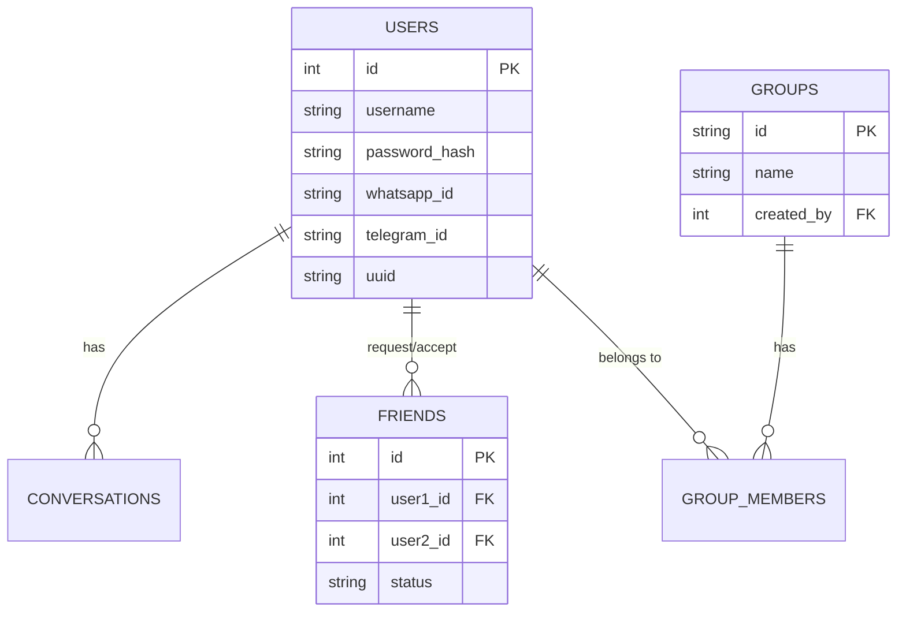

# System Architecture: Social AI Platform 🤖

This document provides a technical overview of how the Social AI Platform is built, the technologies used, and the security measures implemented.

## 🛠️ Technology Stack

- **Core Language**: [Python 3.12+](https://www.python.org/)
- **AI Engine**: [Google Gemini 2.0 Flash](https://aistudio.google.com/) via `google-generativeai`
- **WhatsApp Integration**: [Neonize](https://github.com/TwiN/neonize) (Go-based WhatsApp bridge)
- **Telegram Integration**: [python-telegram-bot](https://python-telegram-bot.org/)
- **Database**: [SQLite3](https://www.sqlite.org/) with `bcrypt` for password hashing
- **Media Processing**: [Pillow](https://python-pillow.org/) (Images) & [MoviePy](https://zulko.github.io/moviepy/) (Video/GIF)

## 🏗️ Core Architecture

The system follows a modular architecture designed for multi-platform scalability:

1.  **Unified Entry Point (`main.py`)**: Uses Python's `multiprocessing` to run separate platform bots (WhatsApp, Telegram) in parallel processes.
2.  **Unified Bot Core (`app/core/bot_core.py`)**: A centralized handler that manages authentication, session state, and command routing regardless of the platform.
3.  **State Machine (`app/core/user_flow.py`)**: Manages complex conversational flows like interactive registration and onboarding.
4.  **LLM Handler (`app/features/llm_handler.py`)**: Abstracts the Gemini API, supporting per-user API keys and custom system prompts (personas).

## 👥 Social & Security Features

### Unique User Identities
Every user is assigned a unique internal ID and a UUID upon registration. All database relations (conversations, friends, group memberships) are keyed to these unique identifiers, ensuring data isolation.

### Friend System
- **Requests**: Handled via a `friends` table with states: `pending` and `accepted`.
- **Privacy**: Only accepted friends can interact in future social features.

### Group Chats
- **Groups**: Created with a unique short ID.
- **Membership**: Managed via a junction table `group_members`.
- **Security**: Only members can access group-specific messages.

### Data Security
- **Passwords**: Never stored in plain text; hashed using `bcrypt` (industry standard).
- **Session Keys**: Backup keys are generated for account recovery, allowing password resets without email-based flows (privacy-first).

## 📊 Entity Relationship Diagram (Conceptual)

---
*Built for Developer: NABORAJ SARKAR (Nishant)*
